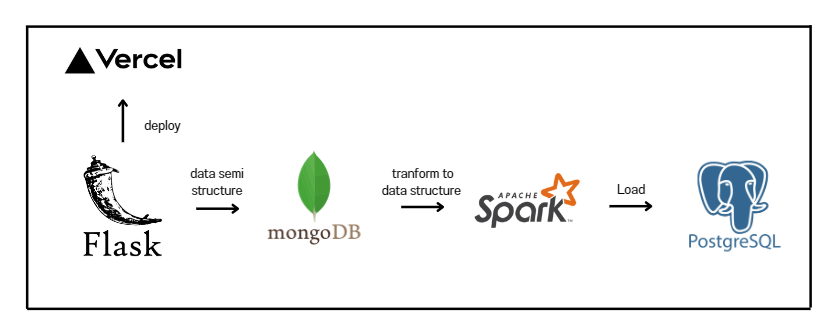
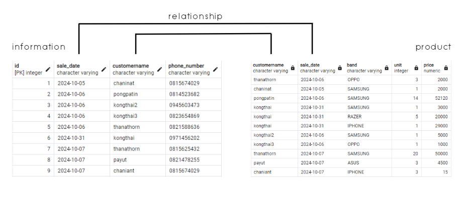

# MongoDB , FLASK , VERCEL , Pyspark , PostgreSQL

## Objective
This project showcases the development of a web application that handles semi-structured data using Flask, MongoDB, PySpark, and PostgreSQL. It demonstrates how to capture, store, transform, and clean semi-structured data in a structured environment using modern data tools.

## Features
- **pymongo 4.9.1** 
- **Flask 2.2.5** 
- **PySpark 3.5.1**

## Workflow
1. **Create Web Application with Flask**
    - Goal: Develop a web form for user input.
    - Tools: Flask (Python), HTML (Frontend)
    - Action:
        - Use Flask to create a Python-based web application.
        - Design an HTML form to capture user order details such as:
        - Customer Name
        - Phone Number
        - Sales Date
        - Product
        - Quantity
        - Price
    - When the user submits the form, Flask captures the data and stores it temporarily before sending it to MongoDB.
2. **Deploy Flask Application to Vercel**
    - Goal: Make the Flask web application accessible online.
    - Tools: Vercel
    - Action:
        - Set up the Flask project for deployment on Vercel.
        - Configure Vercel using the vercel.json file.
        - Push the Flask project to a GitHub repository and connect it with Vercel.
        - Once deployed, users can access the web form through the provided Vercel URL.
3. **Store Data in MongoDB Atlas**
    - Goal: Store form data as semi-structured JSON in MongoDB Atlas.
    - Tools: MongoDB Atlas
    - Action:
        - Set up a MongoDB Atlas database in the cloud.
        - When users submit the form on the Flask application, the data is sent to MongoDB Atlas.
        - Each form submission is saved as a JSON document in a MongoDB collection, allowing for flexible storage of semi-structured data.
4. **Use PySpark for Data Transformation**
    - Goal: Load and transform semi-structured data from MongoDB into structured data for PostgreSQL.
    - Tools: PySpark, MongoDB Connector for Spark
    - Action:
        - Connect PySpark to MongoDB to load the semi-structured data from MongoDB Atlas.
        - Transform the data using PySpark:
            - Clean the data (remove nulls or incorrect entries).
        - After transformation, prepare the data for insertion into a structured relational database (PostgreSQL).
5. **Load Transformed Data into PostgreSQL**
    - Goal: Store the cleaned, transformed data in PostgreSQL and automate data cleaning with triggers.
    - Tools: PostgreSQL
    - Action:
        - Set up a PostgreSQL database to store structured data.
        - Load the transformed data from PySpark into PostgreSQL.
        - Set up a trigger in PostgreSQL to:
        - Automatically assign a primary key (id) sorted by ascending order.
        - Clean the data by removing duplicates based on business rules (checking for repeated customer orders or product entries).

## Link Vercel Web application
- https://djangoproject-gamma.vercel.app/

## Results project
